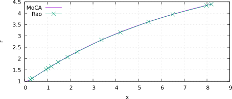
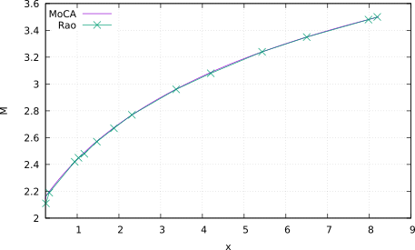
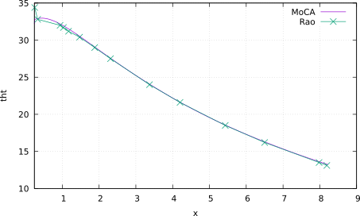
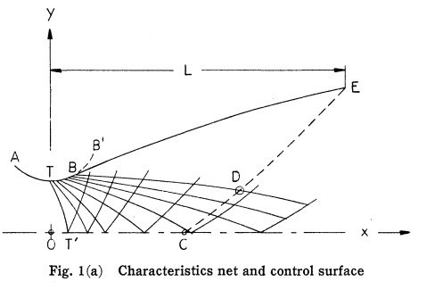

# MoCA - v1.0.0 
***Method of Characteristics for Axisymmetric flows***

## Breve descrição
O código *MoCA* resolve o escoamento compressível de gases através de tubeiras de simetria axial utilizando o método das características [1]. O perfil da tubeira pode ser prescrito pelo usuário ou pode ser determinado pelo método de Rao [2] para que maximize o coeficiente de empuxo. Os resultados produzidos incluem:

- o coeficiente de empuxo;
- a rede de características com a distribuição do número de Mach, do ângulo do vetor velocidade com relação à direção axial;
- os contornos do domínio de cálculo.

## Resultados

O artigo de Rao [1] contém dois exemplos de aplicação do método de otimização proposto pelo autor. O primeiro exemplo foi utilizado para avaliar os resultados produzidos pelo código MoCA. As três figuras abaixo apresentam, nesta ordem, as coordenadas do perfil otimizado, a distribuição do número de Mach sobre o perfil otimizado e a inclinação local do perfil otimizado.

<center>







Comparação entre resultados obtidos com o código MoCA e os resultados de Rao [1].

</center>

O coeficiente de empuxo obtido com o MoCA para o perfil otimizado de Rao também foi comparado com a solução obtida com o software [SU2](https://su2code.github.io/), veja a tabela a seguir. Na simulação com o SU2, considerou-se quatro malhas, 200x10 a 1600x80, com refino uniforme, e o coeficiente de empuxo foi calculado com múltiplas extrapolações de Richardson. O valor 1,7429(2) representa 1,7429+-0,0002. A tabela também apresenta os coeficientes de empuxo para uma tubeira com divergente cônico com o mesmo comprimento e raio de saída do perfil otimizado. A diferença relativa (DR) entre as soluções do MoCA e do SU2 é menor ou igual a 0,05%. O tempo de simulação do código MoCA foi de cerca de 2 s, enquanto o SU2 na malha 1600x80 levou cerca de 13 min.
<center>

|         |  MoCA |         SU2 | DR \(%\) |
|---------|-------|-------------|----------|
|     Rao | 1,743 | 1,7429\(2\) | −0,004   |
|    Cone | 1,725 | 1,7261\(1\) |  0,050   |

Comparação do coeficiente de empuxo obtidos com o código MoCA e com o SU2 para o perfil otimizado de Rao e para um cone com o mesmo comprimento e raio de saída.
</center>

Para mais detalhes sobre estes resultados, veja a [documentação](https://github.com/gbertoldo/MoCA/tree/master/doc) disponível no repositório.

## Como compilar o código fonte no Linux

Pré-requisitos para compilação:

- compilador para C++ (Sugestão: GNU g++)
- biblioteca científica GNU (GSL - GNU Scientific Library)
- CodeBlocks IDE (recomendado)

Para mais detalhes sobre a instalação da biblioteca GSL e do CodeBlocks, assista a este [vídeo](https://www.youtube.com/watch?v=9WZDAnqw8nY&t=7s).

Caso tenha instalado o CodeBlocks, abra o arquivo do projeto *MoCA.cbp* e [compile](https://youtu.be/aQi8TOt6X2o) o código. O executável será gerado em um dos diretórios *./bin/Debug* ou *./bin/Release*, dependendo da opção de compilação.

## Como usar o programa

Basta executar o seguinte comando em um terminal
```
<nome do executável> <config.json>
```
onde `nome do executável` é o nome do executável gerado na compilação e `config.json` é o nome do arquivo de configuração. O arquivo de configuração deve estar no formato [json](https://www.json.org/json-en.html). Para mais detalhes, veja o seguinte [vídeo](https://youtu.be/aQi8TOt6X2o).

## Parâmetros de configuração

Os parâmetros de configuração são apresentados a seguir, juntamente com as opções disponíveis. É importante destacar que todas as variáveis com dimensão de comprimento devem ser parametrizadas em termos do raio da garganta da tubeira. Por exemplo, se o raio da garganta for 15 mm e o comprimento da seção divergente for 60 mm, então as respectivas variáveis parametrizadas serão 1 e 4.
### Propriedades do gás

Informe a razão de calores específicos para caracterizar o gás. Por exemplo:

```
   "Gas":
   {
      "SpecificHeatRatio": 1.23
   }

```

### Propriedades do ambiente

Informe a razão entre a pressão ambiente (para onde o gás da tubeira será descarregando) e a pressão de estagnação. Por exemplo:

```
   "Environment":
   {
      "PressureRatio": 0.0
   }
```

### MoCToolBox
O MoCToolBox é uma classe que implementa as operações unitárias para gerar a rede de características. Para configurá-la, informe o número máximo de iterações no método preditor-corretor *MaxIter*, a tolerância para a diferença absoluta no número de Mach entre duas iterações *Tolerance* e o valor *MachineZero*, abaixo do qual a coordenada radial será tomada como aproximadamente zero. Por exemplo:

```
   "MoCToolBox":
   {
       "MaxIter":      1000,
       "Tolerance":   1E-10,
       "MachineZero": 1E-14
   }
```

### Linha inicial

A linha inicial fornece as condições de contorno para gerar as primeiras características. Esta linha deve estar em uma região suficientemente supersônica do escoamento Ref. [3]. A linha inicial pode ser carregada de um arquivo de texto ou ser gerada pelo código a partir da solução de Kliegel-Levine [4]. 

Para carregar a linha inicial, defina *LoadFromFile* como *true*, indique o arquivo de entrada em *InputFile*, o delimitador de campo em *FieldDelimiter*. O arquivo deve conter quatro colunas com as seguintes informações: a coordenada longitudinal *x*, a coordenada radial *r* ou *y*, o número de Mach *M* e  o ângulo (em radianos) do vetor velocidade relativo ao sentido positivo do eixo axial.

Para gerar a linha inicial com a solução de Kliegel-Levine, defina *LoadFromFile* como *false*, indique o raio de curvatura da parede na garganta *CurvRadiusAtThroatLeft*. Como este raio de curvatura pode assumir valores diferentes à direita e à esquerda da garganta, deve-se ressaltar que *CurvRadiusAtThroatLeft* refere-se ao raio de curvatura à esquerda da garganta (lado da seção convergente). Informe, também, o número de pontos ao longo da linha *NumOfPoints*, o número máximo de iterações *MaxIter* e a tolerância *Tolerance* para gerar a linha inicial de tal modo que o número de Mach seja constante. Por exemplo:
 
```
   "NozzleInitialLine":
   {
       "#Comment": "Options: load from file or use Kliegel-Levine solution",
       "LoadFromFile":                    false,
       "InputFile":        "./input/su2_bc.csv",
       "FieldDelimiter":                    ",",
       "CurvRadiusAtThroatLeft":            1.5,
       "NumOfPoints":                        41,
       "MaxIter":                          1000,
       "Tolerance":                       1E-14
   },
```

### NozzleWall

*NozzleWall* é uma classe abstrata para representar a parede da tubeira. Para executar a simulação, é preciso especificar a classe concreta que representará a parede utilizada. Por exemplo:

```
   "NozzleWall":  "NozzleWallConicalDivergent"
```

As opções disponíveis são:

- NozzleWallConicalDivergent
- NozzleWallInterpolatedDivergent
- NozzleWallRao


#### NozzleWallConicalDivergent

*NozzleWallConicalDivergent* define a parede da seção divergente da tubeira. Esta parede é formada por um arco de circunferência de raio *CurvRadiusAtThroatRight* seguido por um segmento de reta (seção cônica). Defina a forma de construção da seção em *BuildOption*. As opções disponíveis são:

- *AngleAndLength*: define o semiângulo da seção cônica e o comprimento da seção divergente;
- *AngleAndExitRadius*: define o semiângulo da seção cônica e o raio de saída da seção divergente;
- *LengthAndExitRadius*: define o comprimento e o raio de saída da seção divergente;

Defina o semiângulo (em graus) da seção cônica em *DivergentAngleDeg*, o comprimento da seção divergente em *DivergentLength* e o raio de saída da seção divergente em *DivergentExitRadius*.

```
   "NozzleWallConicalDivergent":
   {
        "CurvRadiusAtThroatRight":                  0.45,
        "BuildOption":                  "AngleAndLength",
        "DivergentAngleDeg":                        15.0,
        "DivergentLength":        3.0e+00,
        "DivergentExitRadius":    4.4055871943848759e+00
   }
```

#### NozzleWallInterpolatedDivergent

O perfil da seção divergente da tubeira também pode ser especificado através de um conjunto de pontos em um arquivo de texto. Os pontos são, então, interpolados e utilizados para simulação. Defina o raio de curvatura da parede na garganta (à direita da garganta) *CurvRadiusAtThroatRight*, o nome  do arquivo com os dados *InputFile*, o delimitador de campo *FieldDelimiter*, a unidade do ângulo de inclinação da parede *AngleUnit* e o tipo de interpolação *InterpolationOption*. As [opções](https://www.gnu.org/software/gsl/doc/html/interp.html#d-interpolation-types) disponíveis são:

- linear;
- polynomial;
- cspline;
- akima;
- steffen.

```
   "NozzleWallInterpolatedDivergent":
   {
        "CurvRadiusAtThroatRight":                                  0.45,
	    "InterpolationOption":                                 "steffen",
        "InputFile":               "NozzleWallInterpolatedDivergent.csv",
        "FieldDelimiter":                                            ",",
        "AngleUnit":                                               "deg"
   }
```

#### NozzleWallRao

O divergente da tubeira otimizada de Rao é formado por uma seção circular (TB' da Fig. 1 (a) da Ref.[2]) de raio de curvatura *CurvRadiusAtThroatRight*, seguido por uma seção otimizada para maximizar o coeficiente de empuxo. As duas seções se intersectam com a mesma inclinação. Para gerar a tubeira otimizada de Rao, indique o raio de curvatura da garganta (lado do divergente) *CurvRadiusAtThroatRight*, o número de Mach desejado na saída *ExitMachNumberAtLip* (mais especificamente na borda da tubeira) e o ângulo máximo (em graus) da seção de expansão circular *ThtMaxOnCircularExpansionDeg* (correspondente ao ponto B' da Fig. 1 (a)). O código usará este ângulo para gerar uma rede de características inicial e depois determinará o ângulo correto para a intersecção entre as duas seções.

```
   "NozzleWallRao":
   {
        "CurvRadiusAtThroatRight":      0.45,
        "ExitMachNumberAtLip":           3.5,
        "ThtMaxOnCircularExpansionDeg": 40.0
   }
```
<center>


Fonte: Ref.[2].
</center>

### MoCSolver
*MoCSolver* é uma classe abstrata para resolver o escoamento na tubeira. Para executar a simulação, é preciso especificar a classe concreta que será utilizada:

```
   "MoCSolver": "NozzleMoCRao",
```

As opções de *solvers* são:

- NozzleMoCAdaptive;
- NozzleMoCRao.

O primeiro resolve o escoamento em tubeiras com perfis geométricos prescritos. O segundo determina o perfil otimizado de Rao e resolve o escoamento na tubeira. 

#### NozzleMoCAdaptive

O solver *NozzleMoCAdaptive* cria a rede de característica de modo que a distância entre dois pontos quaisquer ao longo das características C- seja menor ou igual a *dlminus* e que a distância entre dois pontos quaisquer ao longo das características C+ seja menor ou igual a *dlplus*.

```
   "NozzleMoCAdaptive":
   {
       "dlminus": 0.01,
       "dlplus": 100.0
   }

```
#### NozzleMoCRao

O solver *NozzleMoCRao* gera o perfil otimizado da tubeira de Rao e resolve o escoamento. Especifique o solver para resolver o escoamento em *MoCSolver*, a posição máxima em *x* até a qual as características serão geradas *solveUpToX*, o número de pontos ao longo da curva DE *NumberOfPointsAlongDE* (veja a Fig. 1 (a)). 
Este último parâmetro também corresponde ao número de pontos que será gerado para formar o perfil otimizado. No processo de obtenção do perfil otimizado, o método da bisseção é aplicado para determinar o ponto B da  Fig. 1 (a), que corresponte ao ponto de interseção entre a seção circular e a seção otimizada. Seja [xb, xe] o intervalo de busca. Para evitar problemas numéricos, o intervalo de busca deve ser ajustado para [xb . fStartBisection, xe], onde *fStartBisection* deve ser pouco maior que um. Defina o número de pontos da superfície de controle *NumberOfPoints4Interpolation*. A superfície de controle é gerada como um passo intermediário na obtençao do perfil otimizado. Defina o número máximo de iterações *MaxIter* e a tolerância *Tolerance* para o erro no processo iterativo ao gerar o perfil otimizado.

```
  "NozzleMoCRao":
  {
        "MoCSolver":      "NozzleMoCAdaptive",
        "solveUpToX":                    20.0,
        "NumberOfPointsAlongDE":          100,
        "fStartBisection":              1.001,

        "RaoControlSurface":
        {
            "NumberOfPoints4Interpolation": 1000
        },

        "RaoNozzleOptContour":
        {
            "MaxIter":    1000,
            "Tolerance": 1E-14
        }
  }
}
```

## Referências

[1] Shapiro, A. H. The dynamics and thermodynamics of compressible fluid flow Ronald Press Co, 1954, Vol. 2.

[2] Rao, G. V. R. Exhaust Nozzle Contour for Optimum Thrust Journal of Jet Propulsion, 1958.

[3] Anderson Jr., J. D. Modern compressible flow: with historical perspective McGraw-Hill, 2003.

[4] Kliegel, J. R. & Levine, J. N. Transonic Flow in Small Throat Radius of Curvature Nozzles AIAA, 1969, 7, 1375-1378.
